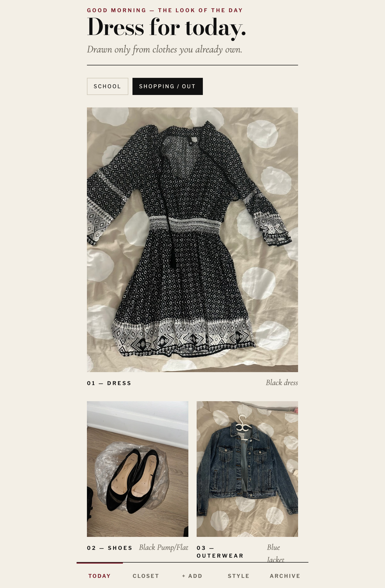
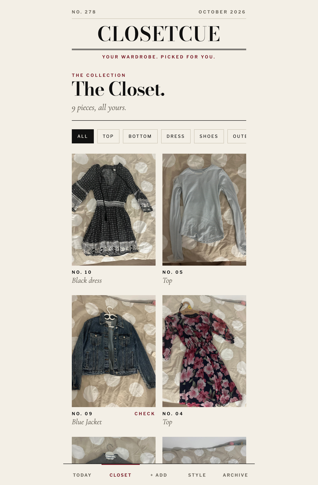
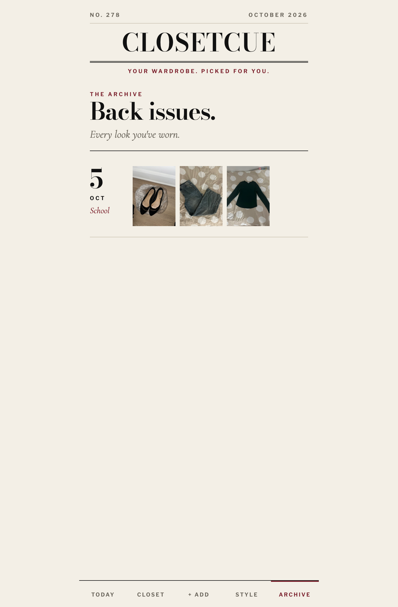

<div align="center">

# C L O S E T C U E

### *Your wardrobe. Picked for you.*

**THE WARDROBE ISSUE · NO. 1 · OCTOBER 2026**

</div>

---



---

## FROM THE EDITOR

Every morning, my sister asks the same question: *"What am I going to wear?"*

She doesn't have a shortage of clothes. She has the opposite problem. Her closet is full, but choosing takes time, she doesn't want to repeat an outfit, and she wants whatever she wears to feel like *her*.

So I stopped suggesting things and started building. **ClosetCue** is a personal wardrobe app made for one person. You photograph the clothes you already own, tell it your style, and every morning it styles you a look from your real closet. It never repeats a complete outfit, and it never suggests anything you don't have.

It started as a weekend project for Hacktoberfest 2026's *Build for a Friend* prompt, and it's now a portfolio piece I'm proud of.

---

## IN THIS ISSUE

1. [The Cover Story](#the-cover-story): what it does
2. [The Interview](#the-interview): what she told me
3. [How the Stylist Thinks](#how-the-stylist-thinks): AI and plain code
4. [Why Open-Weight](#why-open-weight): and what stays on the laptop
5. [The Look](#the-look): the design
6. [Behind the Scenes](#behind-the-scenes): what went wrong
7. [Try It Yourself](#try-it-yourself)
8. [Her Verdict](#her-verdict)
9. [Next Season](#next-season)

---

## THE COVER STORY

> *"Given the clothes this person actually owns, their personal style, what they're doing today, and what they've worn recently, what should they wear?"*

|                             |                                                                                                                                                 |
| --------------------------- | ----------------------------------------------------------------------------------------------------------------------------------------------- |
| **The Closet**              | Upload photos. The AI writes a caption for each piece (category, type, colour, pattern, style, season). You can correct anything it gets wrong. |
| **Your Style**              | Choose the styles and moods you love, from *Minimal* to *Preppy*, *Cute* to *Effortless*. ClosetCue never assumes your style.                   |
| **Today**                   | A look for **School** or **Shopping / Out**, with a hero photo, numbered pieces, and a short note on why it works.                              |
| **Wear this / Try another** | Accept a look and it's filed. Reject one and tell it why.                                                                                       |
| **Build around this**       | Open any piece and ask for looks built around it.                                                                                               |
| **The Archive**             | Every outfit you've worn, by date.                                                                                                              |



---

## THE INTERVIEW

Before writing a line of code, I asked my sister what her problem really was. Her answers became the product:

- Choosing outfits for **school mornings** or going out is hard.
- **Not repeating outfits** is a big worry.
- Choosing what to wear is **stressful**.
- Her two main occasions are **school** and **shopping / going out**.
- **Style** matters most to her.
- She's willing to **photograph her entire wardrobe**.
- Her dream feature: an **outfit waiting for her every morning**.

The problem wasn't "nothing to wear". It was decision fatigue.

---

## HOW THE STYLIST THINKS

I didn't want an AI that does everything. I split the work on purpose:

| The AI handles              | Ordinary code handles                                              |
| --------------------------- | ------------------------------------------------------------------ |
| Reading clothing photos     | Storing the wardrobe                                               |
| Proposing outfits           | Remembering what was worn                                          |
| Explaining why a look works | **Blocking repeats**                                               |
|                             | Checking an outfit is complete (top + bottom or dress, plus shoes) |
|                             | Ranking, validating, saving                                        |

Here's how a look gets made:

```
AI proposes four outfits from your real wardrobe
        ↓
Code removes anything invalid or already used
        ↓
Code ranks what's left: fresh pieces and your style score higher
        ↓
You see the best one, with the stylist's note
```

**The rules the code enforces:** no complete outfit repeats within 14 days, pieces you haven't worn lately rank higher, and every look is built only from clothes in the closet.

**If the AI is slow or offline,** ClosetCue switches to a simple mode that still builds valid, non-repeating outfits. It never leaves you waiting.

---

## WHY OPEN-WEIGHT

ClosetCue runs an open-weight **Gemma** model on my own laptop through **[Ollama](https://ollama.com)**. No paid API, no account, no cost to run.

A wardrobe is personal: photos of someone's clothes and taste. With a local model, the photos are read on the same machine that stores them.

I want to be exact about this, so here's the full picture:

- ✅ Photos and the database stay on the laptop running the app (`backend/uploads/`, `closetcue.db`, both gitignored).
- ✅ The AI runs locally. Nothing is sent to an AI service.
- ⚠️ Your browser loads the page's typefaces from Google Fonts.
- ⚠️ Downloading the model for the first time needs the internet.
- ⚠️ This is a **single-user, local** app. There are no accounts, so it should not be put on the public internet as it is.

---

## THE LOOK

I didn't want a chatbot or a dashboard. I wanted it to feel like opening a magazine.

- **Typefaces:** Bodoni Moda for the masthead and headlines, Cormorant Garamond italics for captions and pull quotes, Libre Franklin for small labels.
- **Palette:** ivory paper, black ink, and one oxblood accent.
- **Rules, not boxes:** hairline lines, sharp corners, no shadows, no emoji.
- **The clothes are the cover star:** big photos, numbered and captioned like a fashion spread.



---

## BEHIND THE SCENES

Things that went wrong, because they're the interesting part:

- **The AI was slow, and uploads froze.** At first, each photo waited for the AI before the next could upload, so ten photos took forever, and reloading lost everything. I rebuilt it: photos save instantly and the AI reads them in a **background queue** that survives reloads and restarts. Unread pieces show "Reading…".
- **Outfits hung when the AI was busy.** Now the AI gets 25 seconds, then simple mode takes over.
- **A lesson about hosting.** A public version needs accounts, private per-user storage and a plan for the AI. It's a rewrite, not a setting, so I kept this one local and honest.

**Built with:** React · TypeScript · Vite · Tailwind CSS · Python · FastAPI · SQLite · Ollama · Gemma

---

## TRY IT YOURSELF

You'll need [Ollama](https://ollama.com), Python 3, and Node.js.

```bash
# 1. Get the model (one time, large download)
ollama pull gemma4:e4b

# 2. Start the backend
cd backend
python3 -m venv .venv && source .venv/bin/activate
pip install -r requirements.txt
uvicorn main:app --reload

# 3. In a second terminal, start the app
cd frontend
npm install
npm run dev -- --host
```

Open the link Vite prints. To use a different model, set `CLOSETCUE_MODEL` before starting the backend. Check which Gemma tags your Ollama version offers with `ollama list`.

**Tips:** photograph one piece at a time on a plain background. Wait for the "Reading…" labels to clear. Tap any piece marked **Check** to fix its category, since outfits depend on those labels.

```
closetcue/
├── backend/    FastAPI app, SQLite, background photo queue
└── frontend/   React app (Vite + Tailwind)
```

---

## NEXT SEASON

- Select **several pieces** to build a look around
- Build an outfit **by hand**
- **Accounts and private per-user storage**, so more people can use it safely
- A gentler first-run guide for photographing a whole closet
- A real **morning notification**

---

<div align="center">

*Made with love, late nights, and one very patient sister.*

**CLOSETCUE · THE WARDROBE ISSUE · NO. 1**

</div>
